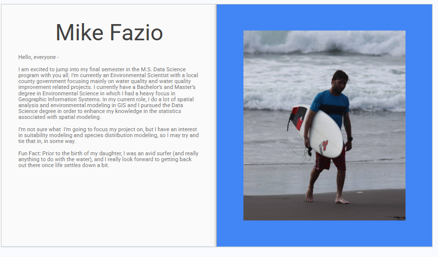
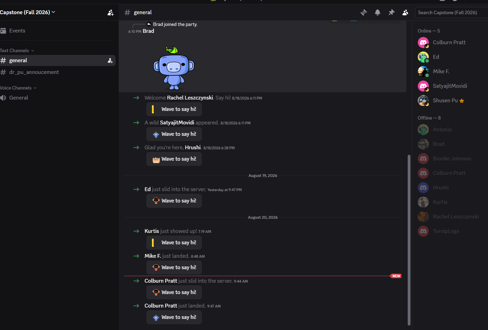

**Course:** Capstone\
**Assignment:** HW #1\
**Instructor:** Shusen Pu

**Student Name:** Mike Fazio

**Due:** 11:59 PM on Sunday\
**Total Points:** 16

------------------------------------------------------------------------

## Question 1 — Introduce Yourself and Meet Your Classmates

**Points: 2**

{fig-align="center"}

------------------------------------------------------------------------

## Question 2 — Join the Course Discord Channel

**Points: 2**

Join the course Discord channel.

{fig-align="center"}

------------------------------------------------------------------------

## Question 3 — Tentative Topic or Method

**Points: 2**

I am interested in exploring using species distribution models (SDMs) such as the MaxEnt framework as an alternative to species suitability modeling. The results of the SDM can be compared to the more standard subjective based suitability modeling workflows often used at present. The benefit of using an SDM vs standard suitability models are that the results are purely statistical in nature, and remove a large portion of subjective bias that can arise in determining which factors should be held most important when determining the suitability.

------------------------------------------------------------------------

## Question 4 — Form a Team

**Points: 5**

Form a team with no more than four members. List your teammates' names in the homework. You can adjust your team anytime before Week 5.

### Team Members

1.  Michael Fazio
2.  
3.  
4.  

------------------------------------------------------------------------

## Question 5 — Research Report Method

**Points: 5**

Please review and study the following two methods for presenting your progress and research report.

### Option 1 — Overleaf

Write your report on Overleaf.

[Open the Overleaf template](https://www.overleaf.com/read/tgrddxgwrhst#ff33cc)

### Option 2 — GitHub

Write your report on GitHub.

[Open the GitHub template](https://github.com/capstone4ds/capstone4ds_template)

Instructions for setting up the website are available on the same page.

**Response**

I plan to use both GitHub and Quarto for my project. GitHub will be used for versioning and file sharing, while most of the documentation and analysis will be done in Positron using both R and Python, depending on which is determined to be the most suitable at the time of analysis.

------------------------------------------------------------------------

**End of HW #1**